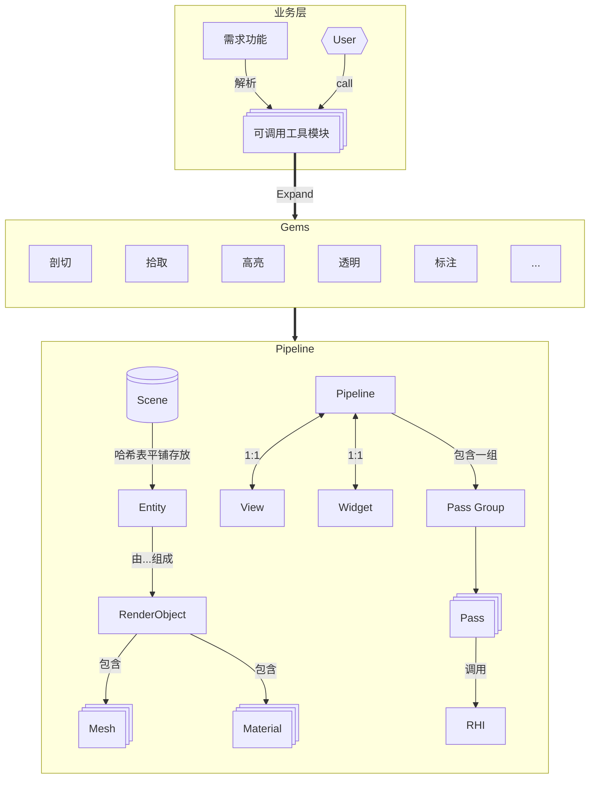

# 当前架构

四层架构

1. 业务层（Operation）可视化模块，针对业务需求，定制接口
2. Gems (译为宝石含义) -> HighLevel 渲染层功能，每个功能相对独立。
3. RPI (Render Pipeline Interface) 渲染管线层，负责实现Gems， 主要数据结构如Pipeline, Scene, View 等。
4. RHI 驱动层，基于Filament RHI, 轻度修改适配。

# Gems
这里列出为后续增量开发/完善的功能
- 深度偏移自定义组合接口 <--- 提供点线面的offset动态组合，在业务层可视化模块中根据场景，动态调整深度偏移组合。
- 填充模式修复 <-- Gems负责接口实现（这里填充模式更偏向于业务层的表述，e.g. 初始借鉴于PointWise FillMode）

# RPI
这里列出为后续增量开发/完善的功能
- 透明完善
- Mesh挂载的材质支持切换，实现透明，填充模式动态修改。该功能负责Gems层填充模式切换的实现
- 高亮效果优化，对标商业软件。
- 材质数据读取。
- Scene重构

# RHI
- 移植Filament RHI <- 当前正在RPI层和业务层替换旧的RHI接口，以及增加在Filament RHI 缺失，但是项目用到的数据结构。

# 基础组件
- 内存分配器框架 <--- 隔离new delete和真正内存分配，内存分配器作为独立模块迭代，e.g. 延迟delete, 监控内存泄漏，环形缓冲、内存池、小对象优化，SoA、AoS排布支持

# 渲染算法持续集成
- 抗锯齿
- PBR
- SSAO
- postprocess passes
- 

